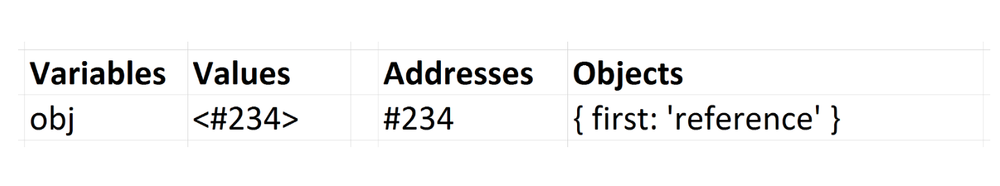

# 자바스크립트에서의 값(value) vs 참조 (Reference)
(컴퓨터 메모리에서 무슨일이 일어나는지 간단히 살펴보자.)

이 기사는 온라인 코스인 [Step Up Your JS: A Comprehensive Guide to Intermediate JavaScript](https://www.educative.io/collection/5679346740101120/5707702298738688?authorName=Arnav%20Aggarwal)에서 가지고 왔다. 
대화식 코드 공간(놀이터)과 온라인 퀴즈를 위해 무료로 볼 수 있다. 
(참고 : 무료로 볼 수 있는 [링크](https://www.educative.io/collection/page/5679346740101120/5707702298738688/5685265389584384))

자바스크립트는 값을 전달하는 Boolean, null, undefined, String, Number 5가지 타입을 가진다. 우리는 이를 Primitive Type이라한다. 

자바스크립트는 참조(Reference)을 전달하는 Array, Function 그리고 Object 3가지 타입을 가진다. 이것은 모두 기술적으로 Object이고, 그래서 우리는 그것들을 Object의 모음이라 언급한다. 

## Primitives

만약 Primitive 타입이 변수에 할당되면, 해당 변수가 primitive 값을 포함한 변수로 생각할 수 있다. 
```javascript
var x = 10;
var y = 'abc';
var z = null;
```
x는 10을 포함, y는 'abc'를 포함한다. 이 아이디어를 확고히 하기 위해서 우리는 이 변수들과 각각의 값들이 메모리에서 어떻게 보이는지에 대한 이미지를 유지할 것이다. 


우리는 =을 사용하여 이들 변수에 다른 변수를 할당할 때, 우리는 새로운 변수의 값을 복사한다. 그리고 우리는 값을 복사한다. 

```javascript
var x = 10;
var y = 'abc';
var a = x;
var b = y;
console.log(x, y, a, b); // -> 10, 'abc', 10, 'abc'
```
a와 x에 10을 모두 포함한다. b와 y는 'abc'를 포함한다. 그들은 값이 복사 되었기 때문에 각각의 변수에 값을 가진다.


하나를 바꾼 다고해서 다른 것이 바뀌는 것은 아니다. 변수들이 서로 관계가 없다고 생각해야한다. 

```javascript
var x = 10;
var y = 'abc';
var a = x;
var b = y;
a = 5;
b = 'def';
console.log(x, y, a, b); // -> 10, 'abc', 5, 'def'
```

## Objects
이것은 혼란스럽겠지만, 참고 끝까지 읽어라. 일단 이겨내면 쉬워 보일 것이다. 
```
기본 값이 아닌 할당된 변수에는 해당 값에 대한 참조가 제공된다. 그 참조는 메모리에서 Object의 위치를 가리키고 있다. 변수에는 실제로 값이 포함되어 있지 않다. 
```

Object는 컴퓨터 메모리의 일부 위치에 생성된다. ```arr = [] ``` 을 작성 했을 때, 메모리에서 배열을 생성한다. arr 변수는 배열의 주소, 위치를 받는다.  

주소가 숫자나 문자열 처럼 값으로 전달되는 새로운 데이터 유형이라고 가정해보자. 주소는 참조에 의해 전달되는 값의 위치, 메모리 위치를 가리킨다. 문자열이 따옴표('' 또는 "")로 표기되는 것처럼, 주소는 화살표 괄호인 <>로 표기된다. 

참조 타입 변수를 할당하고 사용할 때 작성하고 보는 내용은 다음과 같다. 

```javascript
1) var arr = [];
2) arr.push(1);
```

메모리에서 1, 2 라인을 표현하면 아래와 같다.


이 변수 arr은 값을 포함하고, 주소는 정적임을 유의하라. 배열은 메모리에서 변한다. 우리가 값을 push하는 것 처럼 같게 하기 위해서 arr을 사용 할 때, 자바스크립트 엔진은 메모리에 있는 arr의 위치로 가서 그 곳에 있는 저장된 정보로 일을 하게 한다. 

### 참조에 의한 할당 (Assigning by Reference)
참조 유형 값, 즉 object에 =을 사용하여 다른 변수에 복사할 때, 그 값의 주소는 실제로 primitive 처럼 복사되는 것이다. object는 값 대신 참조로 복사된다. 

```javascript
var reference = [1];
var refCopy = reference;
```

위의 코드는 메모리에서는 아래와 같이 보여진다.


각 각의 변수는 지금 같은 배열의 참조를 포함하고 있다. 이 뜻은 만약 reference를 변경하면 retCopy에서 다음과 같은 변경 사항을 볼 수 있다. 

```javascript
reference.push(2);
console.log(reference, refCopy); // -> [1, 2], [1, 2]
```


2를 메모리에 push하고, reference와 refCopy가 사용될 때 같은 배열을 가리키고 있다.

### 참조 재할당 (Reassigning a Reference)
기준이 되는 변수를 재할당하면 기존 참조가 대체 된다.

```javascript
var obj = { first: 'reference' };
```
이것은 메모리에서



두번째 라인을 추가하면
```javascript
var obj = { first: 'reference' };
obj = { second: 'ref2' }
```

주소는 obj 변경사항에 의해 저장이 된다. first object는 여전히 메모리에 존재하며, 그 다음 object도 동일하다. 


위의 주소 ```#234```에서 보듯이 object에 대한 참조가 남아있지 않을 때, 자바스크립트 엔진은 garbage collection을 실행할 수 있다. 이 것은 단지 프로그래머가 그 object에 대한 모든 참조를 잃어버려서 그 object를 더 이상 사용할 수 없다는 것을 의미하므로, 엔진은 계속해서 메모리에서 안전하게 삭제를 할 수 있다. 이 경우 {first:'reference'}는 더 이상 액세스할 수 없으며 엔진에서 garbage collection을 위해 사용할 수 있다.

## == 그리고 ===
일치 연산자 == 그리고 === 은 값과 타입, 참조를 확인할 때 사용한다. 
만약 변수가 같은 아이템의 참조를 포함한다면, 그 비교의 결과는 true이다.

```javascript
var arrRef = [’Hi!’];
var arrRef2 = arrRef;
console.log(arrRef === arrRef2); // -> true
```
만약 구별이 되는 ojbect라면 비록 동일한 porperty들을 포함하고 있더라도 비교 결과는 false이다. 

```javascript
var arr1 = ['Hi!'];
var arr2 = ['Hi!'];
console.log(arr1 === arr2); // -> false
```
만약 두 개가 구별이 되는 object를 가지고 있고, 그 property가 같은지 알아보려고 한다면, 가장 쉬운 방법은 둘다 string으로 변환하고 난 다음 비교 하는 것이다. 일치 연산자가 primitive을 비교할 때, 단순히 값이 같은지 확인한다.

```javascript
var arr1str = JSON.stringify(arr1);
var arr2str = JSON.stringify(arr2);
console.log(arr1str === arr2str); // true
```

또 다른 옵션은 ojbect 사이를 반복적으로 순환하여 각 속성이 동일한지 확인하는 것이다. 

## 함수를 통한 파라미터 전달 
함수를 통해서 primitive 값을 전달할 때, 함수는 값을 파라미터로 복사한다.
이것은 =을 사용하는 것과 사실상 같다. 
```javascript
var hundred = 100;
var two = 2;
function multiply(x, y) {
    // PAUSE
    return x * y;
}
var twoHundred = multiply(hundred, two);
```

위의 예제에서, hundred의 값은 100이다. hundred가 multiply로 전달되어 변수 x 가 그 값을 100으로 얻는다. 이 값은 마치 =을 사용하여 값이 복사 되어졌다. 다시 말하지만, hundred의 값은 영향을 받지 않는다. multiply 함수 안의 PAUSE 주석에서 메모리가 어떻게 생겼는지 보여주는 스냅샷이 있다. (Here is a snapshot of what the memory looks like right at the PAUSE comment line in multiply.)


### 순수 함수(Pure Function)
우리는 외부 scope에서 아무런 영향을 받지 않는 함수를 pure Function이라고 부른다. 함수가 primitive 값만을 파라미터로 하고, 그 주변 scope에 변수를 사용하지 않는 한, 외부 scope의 어떤 것도 영향을 줄 수 없기 때문에 자동적으로 pure해진다. 내부에서 생성된 모든 변수는 함수가 반환되는 즉시 garbage-colledted 해진다. 

참고 
- [가비지콜렉션](https://developer.mozilla.org/ko/docs/Web/JavaScript/Memory_Management)
- [자바스크립트는 어떻게 작동하는가: 메모리 관리 + 4가지 흔한 메모리 누수 대처법](https://engineering.huiseoul.com/%EC%9E%90%EB%B0%94%EC%8A%A4%ED%81%AC%EB%A6%BD%ED%8A%B8%EB%8A%94-%EC%96%B4%EB%96%BB%EA%B2%8C-%EC%9E%91%EB%8F%99%ED%95%98%EB%8A%94%EA%B0%80-%EB%A9%94%EB%AA%A8%EB%A6%AC-%EA%B4%80%EB%A6%AC-4%EA%B0%80%EC%A7%80-%ED%9D%94%ED%95%9C-%EB%A9%94%EB%AA%A8%EB%A6%AC-%EB%88%84%EC%88%98-%EB%8C%80%EC%B2%98%EB%B2%95-5b0d217d788d)

그러나 object를 가져오는 함수는 주변 scope의 상태를 변형시킬 수 있다. 만약 함수가 Array 참조를 가지고 와서 해당 함수를 가리키는 배열을 변경한 경우, 해당 배열을 참조하는 범위의 변수는 변화를 감지한다. 함수가 반환된 후, 외부 scope에서 계속 유지된다. 이것은 추적이 어려울 수 있는 side effect를 일으킬 수 있다. 

따라서 Array.map과 Array.filter를 포함한 많은 native array 함수는 pure function으로 쓰여진다. 그들은 array 참조를 복사하고, 원본 대신 복사본으로 작업한다. 이렇게 하면 원본은 그대로, 외부 scope는 영향을 받지 않고, 새로운 array에 대한 참조가 반환된다.

pure vs와 impure function의 예를 보자.

```javascript
function changeAgeImpure(person) {
    person.age = 25;
    return person;
}
var alex = {
    name: 'Alex',
    age: 30
};
var changedAlex = changeAgeImpure(alex);
console.log(alex); // -> { name: 'Alex', age: 25 }
console.log(changedAlex); // -> { name: 'Alex', age: 25 }
```

이 impure function은 어떤 object를 가지고, object의 age을 25로 변경한다. 이는 참조에 따라 작용하기 때문에 alex object를 직접적으로 변화 시킨다. person 객체를 반환할 때, 전달된 object와 정확히 동일한 object를 반환한다는 점에 유의해라. alex와 alexChanged는 (코드로 봤을 때는 changedAlex같은데 ...여튼..)는 동일한 참조를 포함하고 있다. person변수를 반환하고 참조를 새 변수에 저장하는 것은 중복이다. 

pure한 함수를 보자.

```javascript
function changeAgePure(person) {
    var newPersonObj = JSON.parse(JSON.stringify(person));
    newPersonObj.age = 25;
    return newPersonObj;
}
var alex = {
    name: 'Alex',
    age: 30
};
var alexChanged = changeAgePure(alex);
console.log(alex); // -> { name: 'Alex', age: 30 }
console.log(alexChanged); // -> { name: 'Alex', age: 25 }
```

이 함수에서 JSON.stringify를 사용하여 object를 문자열로 반환한 다음, 다시 JSON.parse로 object를 파싱한다. 이 변환을 수행하고 그 결과를 새로운 변수에 저장함으로써 우리는 새로운 object를 만들었다. 원래의 object를 반복하고 각각의 속성을 새로운 객체에 할당하는 것과 같은 다른 방법이 있지만, 이 방법은 간단하다. 새로운 object는 원래 object와 같은 property를 가지고 있지만 메모리에서 각각 분리된 object이다. 

이 새로운 object에서 age속성을 바꾸면 원본은 영향을 받지 않는다. 이 기능은 이제 pure해졌다. 이것은 자신의 scope 밖의 어떤 object도 영향을 줄 수 없고, 심지어 전달된 object도 영향을 줄 수 없다. 새로운 object는 반환되고 새로운 변수에 저장 되어야 한다. 그렇지 않으면 더 이상 scope에 포함되지 않기 때문에 함수가 완료되면 garbage collected되어 진다. 

### 테스트
Value와 reference는 코딩 인터뷰에서 시험이 되어진 개념이다. 요기에서 무엇이 기록이 되었는지 스스로 알아내도록 노력해보라. 

```javascript
function changeAgeAndReference(person) {
    person.age = 25;
    person = {
        name: 'John',
        age: 50
    };
    
    return person;
}
var personObj1 = {
    name: 'Alex',
    age: 30
};
var personObj2 = changeAgeAndReference(personObj1);
console.log(personObj1); // -> ?
console.log(personObj2); // -> ?
```
이 함수는 먼저 전달된 원래의 object에 대한 age property를 변경한다. 그 다음 변수를 새 object에 재할당하여 object를 반환한다. 여기 두 object가 logout된 내용이 있다.  

```javascript
console.log(personObj1); // -> { name: 'Alex', age: 25 }
console.log(personObj2); // -> { name: 'John', age: 50 }
```
함수 파라미터를 통한 할당은 =으로 할당 되는 것과 동일하다는 것을 기억하라. 함수에서 person변수는 personObj1을 참조하는 것을 포함하고 있다. 그래서 처음에는 그 object에 직접 적용이 된다. 일단 person은 새로운 object에 재할당하면 원래 object에 영향을 주지 않는다. 

이러한 재할당은 personObj1이 외부 scope에서 가리키는 object를 변경하지 않는다. person이 재할당 되었기 때문에 새로운 참조가 있지만 이 재할당은 personObj1을 변경하지 않는다.

위의 블록과 같은 코드들은 다음과 같다.

```javascript
var personObj1 = {
    name: 'Alex',
    age: 30
};
var person = personObj1;
person.age = 25;
person = {
  name: 'john',
  age: 50
};
var personObj2 = person;
console.log(personObj1); // -> { name: 'Alex', age: 25 }
console.log(personObj2); // -> { name: 'John', age: '50' }
```
유일한 차이점은 우리가 그 함수를 사용할 때, 그 함수가 일단 끝나면 person은 더 이상 그 scope에 있지 않다는 것이다. 

## 바로 그겁니다. 가서 몇몇의 코드를 사용하라.
— — — — 

만약 이것이 유용하다면, 글쓴이의 작품들을 확인해...

> 원문 출처 :번역 원본 URL : https://codeburst.io/explaining-value-vs-reference-in-javascript-647a975e12a0

## 참조와 관련하여 정리 했었던 에버노트 링크
- https://www.evernote.com/l/AqB0xOLXgJxIj7r_4e1P7Il_JE6edY6U7Ps

이건 테스트

