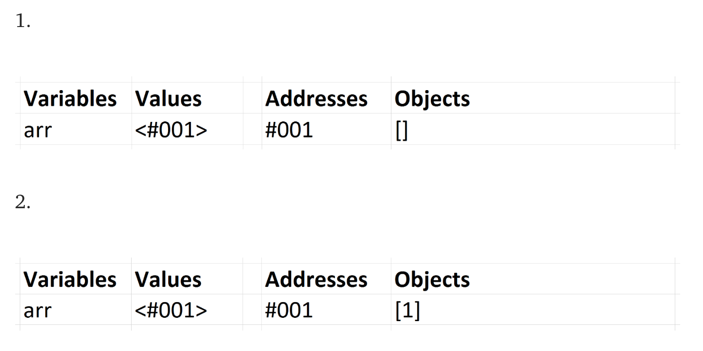

# 자바스크립트에서의 값(value) vs 참조 (Reference)
(컴퓨터 메모리에서 무슨일이 일어나는지 간단히 살펴보자.)

이 기사는 온라인 코스인 [Step Up Your JS: A Comprehensive Guide to Intermediate JavaScript](https://www.educative.io/collection/5679346740101120/5707702298738688?authorName=Arnav%20Aggarwal)에서 가지고 왔다. 
대화식 코드 공간(놀이터)과 온라인 퀴즈를 위해 무료로 볼 수 있다. 
(참고 : 무료로 볼 수 있는 [링크](https://www.educative.io/collection/page/5679346740101120/5707702298738688/5685265389584384))

자바스크립트는 값을 전달하는 Boolean, null, undefined, String, Number 5가지 타입을 가진다. 우리는 이를 Primitive Type이라한다. 

자바스크립트는 참조(Reference)을 전달하는 Array, Function 그리고 Object 3가지 타입을 가진다. 이것은 모두 기술적으로 Object이고, 그래서 우리는 그것들을 Object의 모음이라 언급한다. 

## Primitives

만약 Primitive 타입이 변수에 할당되면, 해당 변수가 primitive 값을 포함한 변수로 생각할 수 있다. 
```javascript
var x = 10;
var y = 'abc';
var z = null;
```
x는 10을 포함, y는 'abc'를 포함한다. 이 아이디어를 확고히 하기 위해서 우리는 이 변수들과 각각의 값들이 메모리에서 어떻게 보이는지에 대한 이미지를 유지할 것이다. 


우리는 =을 사용하여 이들 변수에 다른 변수를 할당할 때, 우리는 새로운 변수의 값을 복사한다. 그리고 우리는 값을 복사한다. 

```javascript
var x = 10;
var y = 'abc';
var a = x;
var b = y;
console.log(x, y, a, b); // -> 10, 'abc', 10, 'abc'
```
a와 x에 10을 모두 포함한다. b와 y는 'abc'를 포함한다. 그들은 값이 복사 되었기 때문에 각각의 변수에 값을 가진다.


하나를 바꾼 다고해서 다른 것이 바뀌는 것은 아니다. 변수들이 서로 관계가 없다고 생각해야한다. 

```javascript
var x = 10;
var y = 'abc';
var a = x;
var b = y;
a = 5;
b = 'def';
console.log(x, y, a, b); // -> 10, 'abc', 5, 'def'
```

## Objects
이것은 혼란스럽겠지만, 참고 끝까지 읽어라. 일단 이겨내면 쉬워 보일 것이다. 
```
기본 값이 아닌 할당된 변수에는 해당 값에 대한 참조가 제공된다. 그 참조는 메모리에서 Object의 위치를 가리키고 있다. 변수에는 실제로 값이 포함되어 있지 않다. 
```

Object는 컴퓨터 메모리의 일부 위치에 생성된다. ```arr = [] ``` 을 작성 했을 때, 메모리에서 배열을 생성한다. arr 변수는 배열의 주소, 위치를 받는다.  

주소가 숫자나 문자열 처럼 값으로 전달되는 새로운 데이터 유형이라고 가정해보자. 주소는 참조에 의해 전달되는 값의 위치, 메모리 위치를 가리킨다. 문자열이 따옴표('' 또는 "")로 표기되는 것처럼, 주소는 화살표 괄호인 <>로 표기된다. 

참조 타입 변수를 할당하고 사용할 때 작성하고 보는 내용은 다음과 같다. 

```javascript
1) var arr = [];
2) arr.push(1);
```

메모리에서 1, 2 라인을 표현하면 아래와 같다.



이 변수 arr은 값을 포함하고, 주소는 정적임을 유의하라. 배열은 메모리에서 변한다. 우리가 값을 push하는 것 처럼 같게 하기 위해서 arr을 사용 할 때, 자바스크립트 엔진은 메모리에 있는 arr의 위치로 가서 그 곳에 있는 저장된 정보로 일을 하게 한다. 

### 참조에 의한 할당 (Assigning by Reference)
참조 유형 값, 즉 object에 =을 사용하여 다른 변수에 복사할 때, 그 값의 주소는 실제로 primitive 처럼 복사되는 것이다. object는 값 대신 참조로 복사된다. 

```javascript
var reference = [1];
var refCopy = reference;
```

위의 코드는 메모리에서는 아래와 같이 보여진다.


각 각의 변수는 지금 같은 배열의 참조를 포함하고 있다. 이 뜻은 만약 reference를 변경하면 retCopy에서 다음과 같은 변경 사항을 볼 수 있다. 

```javascript
reference.push(2);
console.log(reference, refCopy); // -> [1, 2], [1, 2]
```


2를 메모리에 push하고, reference와 refCopy가 사용될 때 같은 배열을 가리키고 있다.

### 참조 재할당 (Reassigning a Reference)
기준이 되는 변수를 재할당하면 기존 참조가 대체 된다.

```javascript
var obj = { first: 'reference' };
```
이것은 메모리에서


두번째 라인을 추가하면
```javascript
var obj = { first: 'reference' };
obj = { second: 'ref2' }
```

주소는 obj 변경사항에 의해 저장이 된다. first object는 여전히 메모리에 존재하며, 그 다음 object도 동일하다. 


위의 주소 ```#234```에서 보듯이 object에 대한 참조가 남아있지 않을 때, 자바스크립트 엔진은 garbage collection을 실행할 수 있다. 이 것은 단지 프로그래머가 그 object에 대한 모든 참조를 잃어버려서 그 object를 더 이상 사용할 수 없다는 것을 의미하므로, 엔진은 계속해서 메모리에서 안전하게 삭제를 할 수 있다. 이 경우 {first:'reference'}는 더 이상 액세스할 수 없으며 엔진에서 garbage collection을 위해 사용할 수 있다.

## == 그리고 ===
일치 연산자 == 그리고 === 은 값과 타입, 참조를 확인할 때 사용한다. 
만약 변수가 같은 아이템의 참조를 포함한다면, 그 비교의 결과는 true이다.

```javascript
var arrRef = [’Hi!’];
var arrRef2 = arrRef;
console.log(arrRef === arrRef2); // -> true
```
만약 구별이 되는 ojbect라면 비록 동일한 porperty들을 포함하고 있더라도 비교 결과는 false이다. 

```javascript
var arr1 = ['Hi!'];
var arr2 = ['Hi!'];
console.log(arr1 === arr2); // -> false
```
만약 두 개가 구별이 되는 object를 가지고 있고, 그 property가 같은지 알아보려고 한다면, 가장 쉬운 방법은 둘다 string으로 변환하고 난 다음 비교 하는 것이다. 일치 연산자가 primitive을 비교할 때, 단순히 값이 같은지 확인한다.

```javascript
var arr1str = JSON.stringify(arr1);
var arr2str = JSON.stringify(arr2);
console.log(arr1str === arr2str); // true
```

또 다른 옵션은 ojbect 사이를 반복적으로 순환하여 각 속성이 동일한지 확인하는 것이다. 

## 함수를 통한 파라미터 전달 
함수를 통해서 primitive 값을 전달할 때, 함수는 값을 파라미터로 복사한다.
이것은 =을 사용하는 것과 사실상 같다. 
```javascript
var hundred = 100;
var two = 2;
function multiply(x, y) {
    // PAUSE
    return x * y;
}
var twoHundred = multiply(hundred, two);
```

위의 예제에서, hundred의 값은 100이다. hundred가 multiply로 전달되어 변수 x 가 그 값을 100으로 얻는다. 이 값은 마치 =을 사용하여 값이 복사 되어졌다. 다시 말하지만, hundred의 값은 영향을 받지 않는다. multiply 함수 안의 PAUSE 주석에서 메모리가 어떻게 생겼는지 보여주는 스냅샷이 있다. (Here is a snapshot of what the memory looks like right at the PAUSE comment line in multiply.)


### Pure Functions
We refer to functions that don’t affect anything in the outside scope as pure functions. As long as a function only takes primitive values as parameters and doesn’t use any variables in its surrounding scope, it is automatically pure, as it can’t affect anything in the outside scope. All variables created inside are garbage-collected as soon as the function returns.

A function that takes in an Object, however, can mutate the state of its surrounding scope. If a function takes in an array reference and alters the array that it points to, perhaps by pushing to it, variables in the surrounding scope that reference that array see that change. After the function returns, the changes it makes persist in the outer scope. This can cause undesired side effects that can be difficult to track down.

Many native array functions, including Array.map and Array.filter, are therefore written as pure functions. They take in an array reference and internally, they copy the array and work with the copy instead of the original. This makes it so the original is untouched, the outer scope is unaffected, and we’re returned a reference to a brand new array.

Let’s go into an example of a pure vs. impure function.

```javascript
function changeAgeImpure(person) {
    person.age = 25;
    return person;
}
var alex = {
    name: 'Alex',
    age: 30
};
var changedAlex = changeAgeImpure(alex);
console.log(alex); // -> { name: 'Alex', age: 25 }
console.log(changedAlex); // -> { name: 'Alex', age: 25 }
```

This impure function takes in an object and changes the property age on that object to be 25. Because it acts on the reference it was given, it directly changes the object alex. Note that when it returns the person object, it is returning the exact same object that was passed in. alex and alexChanged contain the same reference. It’s redundant to return the person variable and to store the reference in a new variable.

Let’s look at a pure function.

```javascript
function changeAgePure(person) {
    var newPersonObj = JSON.parse(JSON.stringify(person));
    newPersonObj.age = 25;
    return newPersonObj;
}
var alex = {
    name: 'Alex',
    age: 30
};
var alexChanged = changeAgePure(alex);
console.log(alex); // -> { name: 'Alex', age: 30 }
console.log(alexChanged); // -> { name: 'Alex', age: 25 }
```
In this function, we use JSON.stringify to transform the object we’re passed into a string, and then parse it back into an object with JSON.parse. By performing this transformation and storing the result in a new variable, we’ve created a new object. There are other ways to do the same thing such as looping through the original object and assigning each of its properties to a new object, but this way is simplest. The new object has the same properties as the original but it is a distinctly separate object in memory.

When we change the age property on this new object, the original is unaffected. This function is now pure. It can’t affect any object outside its own scope, not even the object that was passed in. The new object needs to be returned and stored in a new variable or else it gets garbage collected once the function completes, as the object is no longer in scope.

### 테스트
Value vs. reference is a concept often tested in coding interviews. Try to figure out for yourself what’s logged here.

```javascript
function changeAgeAndReference(person) {
    person.age = 25;
    person = {
        name: 'John',
        age: 50
    };
    
    return person;
}
var personObj1 = {
    name: 'Alex',
    age: 30
};
var personObj2 = changeAgeAndReference(personObj1);
console.log(personObj1); // -> ?
console.log(personObj2); // -> ?
```
The function first changes the property age on the original object it was passed in. It then reassigns the variable to a brand new object and returns that object. Here’s what the two objects are logged out.

```javascript
console.log(personObj1); // -> { name: 'Alex', age: 25 }
console.log(personObj2); // -> { name: 'John', age: 50 }
```

Remember that assignment through function parameters is essentially the same as assignment with =. The variable person in the function contains a reference to the personObj1 object, so initially it acts directly on that object. Once we reassign person to a new object, it stops affecting the original.

This reassignment does not change the object that personObj1 points to in the outer scope. person has a new reference because it was reassigned but this reassignment doesn’t change personObj1.

An equivalent piece of code to the above block would be:

```javascript
var personObj1 = {
    name: 'Alex',
    age: 30
};
var person = personObj1;
person.age = 25;
person = {
  name: 'john',
  age: 50
};
var personObj2 = person;
console.log(personObj1); // -> { name: 'Alex', age: 25 }
console.log(personObj2); // -> { name: 'John', age: '50' }
```
The only difference is that when we use the function, person is no longer in scope once the function ends.

## That’s it. Go write some code.
— — — — 

If this was useful, please hit the heart and feel free to check out my other work.


## 참조와 관련하여 정리 했었던 에버노트 링크
- https://www.evernote.com/l/AqB0xOLXgJxIj7r_4e1P7Il_JE6edY6U7Ps