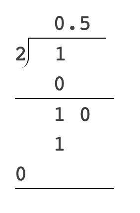
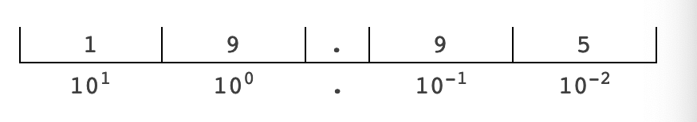
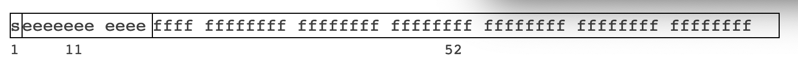
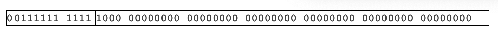

## 모든 자바스크립트 개발자가 알아야하는 부동소수점 숫자

> 참고 : Floating Points은 부동소수점이라 부른다.

자바스크립트에 대한 강연을 한 이후에(정말로, 나는 내가 낸 책에 부끄러워 하지 않고 말한다. - [Underhanded JavaScript](https://leanpub.com/underhandedjavascript)와 이것의 대체한 책인 - [JavaScript Techinical Interview Questions](https://leanpub.com/jsinterviewquestions?utm_source=Blog&utm_medium=Blog&utm_term=jsfloat&utm_content=jsfloat&utm_campaign=jsfloat-blog)), 그 자리에서 Q&A 세션이 있었다. 
나는 대부분의 질문에 대답할 수 있었으나 khalid hilaby의 자바스크립트 number 타입에 대한 질문에 대해 흥미롭고 일반적인 질문을 하였다. 
그는 단순히 자바스크립트의 float에 대해 훨씬 더 많이 아는 것을 원했었다. 그리고 왜 그들이 이상한 반응을 보였는지 알고 싶었다. 
나는 이 질문에 대답하는 동안, 나는 이 대답이 부족하다 생각이 되었다.
나는 부동 소수점의 구조에 대한 설명을 하기 위해 Go의 "Pointer Tagging"이라는 기사를 실었다. 해당 기사에는 부동 소수점의 산술에 대한 설명과 옛날에는 부동소수점(FPUs)에 대한 특수한 CPU를 사용 해야만 했다는 내용을 기술 하였다.  

지금 나는 시드니로 돌아왔고, 휴식을 취했으니 다시 한번 더 이 질문에 대해 생각해보려고 한다. 그 결과가 Flippin Awesome에 기사로 존재한다. (What Every JavaScript Developer Should Know About Floating Points )
이 글은 Flippin Awesome에 올리기 전의 전체 버젼이다. 

> 참고 : 
현재 What Every JavaScript Developer Should Know About Floating Points에 걸려진 링크는 없어진 페이지로 보임 또한 Flippin Awesome에 글을 올리려면 길이와 내용이 적합한지 등등 체크를 진행한 것으로 번역으로 추측함.

이 기사에서는 독자들이 base-2의 base-10 숫자에 익숙하다고 가정한다.(i.e. 1은 1<sub>b</sub>, 2는 10<sub>b</sub>, 3은 11<sub>b</sub>, 4는 100<sub>b</sub> 등등). 
이 기사에서는 숫자의 표현이 10진법이란 단어는 숫자의 십진법을 가리킨다. (예,2.718)
"이진"이라는 단어는 기계표현을 가리킨다. 
여기에서 각각 base-10, base-2으로 쓰인다. 

> 참고 : 여기에서 base-10은 10진수, base-2은 2진수라고 가르키는 것 같음...

### Floating Points (부동 소수점)
부동 소수점이 무엇인지 알기 위해 우리는 첫번째로 많은 숫자의 종류가 있다는 것에서 시작해야하고 우리는 이를 진행할 것이다.  우리는 **1**은 정수라 부른다. - 이것은 분수값이 없는 정수이다. 

½은 분수라고 불린다. 이것은 1을 2로 나누고 있다는 것을 암시한다. 분수는 부동 소수점을 설명하는데 매우 중요한 개념이다. 

**0.5**는 일반적으로 10진수로 알려져있다. 그러나 매우 중요한 구분이 필요한데, 이 는 
**0.5**는 실제로 분율 1⁄2의 십진수(base-10) 표현이다. 위치 표기법이라고 부르는 이것은 base-10 숫자로 쓸 때 1/2를 나타내는 방법이다.

분수에 대한 표현의 숫자가 유한하기 때문에 **0.5**를 유한 표현이라고 부른다. **0.5**에서 **5**이후의 숫자는 더 이상 없다. 예를 들어 무한 표현은 1/3을 나타낼 때 **0.33333**이다. 이 아이디어는 나중에 중요한 아이디어가 된다 
 
정수, 분수 또는 소수 표기법 이외의 숫자를 나타내는 다른 방법들도 존재한다. 
이전에 실제로 본적이 있을 것이다. 
이것은 <b>6.022 x 10<sup>23</sup></b>와 같은 것을 봤다. 이것은 표준화된 형식으로 알려진 과학적 표기법으로 알려져 있다. 
이 형식은 아래의 수식처럼 일반화 할 수 있다. 

D<sub>1</sub>.D<sub>2</sub>D<sub>3</sub>D<sub>4</sub>...D<sub>p</sub> x B<sup>E</sup>

일반적인 양식을 부동소수점이라 부른다. 

<b>D, D1.D2D3D4…D<sub>p</sub></b>의 **p** 자릿수 시퀀스를 <i>Significands</i> 또는 <i>Mantissa</i>라고 합니다. **p**는 정밀도(<i>Precision</i>)라고 하는 중요한 숫자의 수이다. 위의 간단한 아보가드로의 수의 경우 **p**을 **4**로 하자. **x**는 mantissa를 따른다.
(그리고 표기법의 일부이고, 여기서 곱셈 기호는 *이다. )

기본 숫자 다음에 지수(<i>Exponent</i>)가 나온다. 지수는 양수 또는 음수일 수 있다. 

부동 소수점의 장점은 어떤 수를 나타내는데도 사용될 수 있다는 것이다. 
예를 들어 정수 **1**은 <b>1.0*10<sup>0</sup></b>으로 나타낼 수 있다. 빛의 속도는 초당 <b>2.99792458 x 10<sup>6</sup>m</b>으로 나타낼 수 있다. 1/2은 base-2에 <b>0.1 * 2<sup>0</sup></b>으로 나타낼 수 있다. 

### The Radix Point (라딕스 포인트)
> 참고 : [위키피디아 설명](https://en.wikipedia.org/wiki/Radix_point)
위의 마지막 예가 이상해보였다면, 그것은 우리가 일반적으로 base-2에서 분수 표현을 본 적이 없기 때문이다. 

라딕스 포인트로 분수를 이진수로 표현하는 방법에 대해 알려주려한다. 

하지만 10진 표현부터 살펴뵤자. 왜 1/2이 0.5일까? 학교에서 긴 나눗셈을 배웠지 않나?
학교에서 배운 나눗셈 또한 왜 1/2이 0.5인지 설명하는 방법이었고, 단순히 1을 2로 나누었을 뿐이다. 


분수를 보는 또 다른 방법은 분수를 숫자 기반과 지수적 관점에서 보는 것이다. 1/2은 5/10처럼 분모로 10<sup>1</sup>을 사용하여 분수로 표현할 수 있다. 

사실, 분수를 라딕스 포인트로 정교하게 표현할 수 있는지 여부를 결정하는 것이 규칙이다. 분모를 분수로 표현하고 분모로 지수화할 수 있다면 라딕스 포인트 표기법으로 정교하게  표현될 수 있다. 

위치 표기법 뒤에 있는 아이디어는 간단하다. 예를 들어보자. **19.95**(해당 글의 작성자의 고려중인 책의 가격)의 숫자에 대해 생각해보자. 이는 다음과 같은 위치로 나눌 수 있다. 




이는 **10**단위의 위치에 1,**1**단위 위치에서 9, **0.1**단위의 위치에 9,**0.01** 단위의 위치에 5 가 있다는 것을 의미한다. 

이 개념은 마찬가지로 base-2로 확장될 수 있다. 10의 거듭제곱 대신에 base-2에 대한 위치 표기법은 2의 거듭제곱을 그 위치로 가지고 있다. base-2에서 **10**이 2, base-2에서 **100**이 4인 것도 이러한 이유 때문이다. 

숫자가 base-2에서 유한하게 표현 될 수 있는 경우, 위의 것과 동일한 방법으로 적용이 된다. 분수가 2의 거듭제곱인 분모로 표현될 수 있는지 확인하라.

간단한 예) 0.75

**0.75**는 **3/4**로 표현한다. base-2로 표현하면 **4**는 **100**이다. 그래서 우리는 **11/100**으로 표현할 수 있다. 우리는 **0.11**로 유한한 표현이라는 것을 알 수 있다. base-2 숫자로 긴 나눗셈을 하는 것도 같은 결과를 낳는다.  

또한 십진수에서 base-2 라딕스 포인트 표현으로 변환하는 쉬운 방법(단순한 방법)이 있는데, 이는 빠른 추정을 위해 다음과 같이 한다.

1. 10진수의 소수점 부분에 2를 곱한다. : **0.75 * 2 = 1.50**
2. 1.의 결과에서 정수 부분을 놔두고, base-2 라딕스 포인트 표시는 **0.1** 이다.
3. 결과에서 소수점 부분(1의 결과에서 소수점 부분은 0.5)에 2를 곱한다. :  **0.5 * 2 = 1.00**
4. 2,3을 끝날 때까지 반복한다 : 라딕스 포인트는 **0.11**
5. 원래 소수점의 모든 정수의 부분에 base-2로 대체한다.

자 , 이제 1/10 분수를 두 가지 방법 중 하나를 해보아라. 재미있는 결과가 있을 것이고 이것은 나중에 중요할 것이다. 


### 라딕스 포인트 제거
위의 예제는 우리는 여전히 라딕스 포인트(숫자에서의 점)를 갖는 것에 꽤 얽매여 있다. 이것은 어떤 것을 2진법으로 표현할 때 몇가지 문제를 제시한다. 

<b>3.14159 x 10<sup>0</sup></b>임의의 부동소수점과 같은 부동 소수점으로 나타낼 수 있다.
base-2 표현으로 보면 **11.00100100 001111…** 이렇게 보일 것이다. 숫자가 16비트 방식으로 표시된다고 가정할 때, 이는 숫자가 기계에 **11001001000011111** 이렇게 배치됨을 의미한다. 이제 질문은 다음과 같다. 라딕스 포인트 지점은 어디에 있어야 하는가 ? 이건 아직 지수를 포함하지 않는다. (우리는 암묵적으로 base-2라고 가정한다.)

**5.14159**이라는 숫자라면 어떻게 될까? 정수형 부분은 **11**이 아니라 **101**이 될 것이며, 하나의 비트 필드를 더 필요로 한다. 

물론 필드의 첫번째 n비트는 정수부분(라딕스 지점의 왼쪽)에 속하고, 나머지는 분수 부분에 속한다고 명시할 수 있지만, 고정소수점에 관한 또 다른 기사의 주제다. 

D<sub>1</sub>D<sub>2</sub>D<sub>3</sub>D<sub>4</sub>...D<sub>p</sub> ⁄ B<sup>p-1</sup> x B<sup>E</sup>

이것이 우리가 우리의 이항 부동 소수점을 얻는 곳이다. 이제 significand는 정수이다. 이것은 기계에 부동 소수점 번호를 저장하는 것을 훨씬 더 쉽게 만든다. 실제로 부동 소수점을 이진법으로 표현하는데 가장 널리 사용되는 방법은 IEEE 754 형식이다. 
> 참고 : IEEE('아이트리플'이라고 읽음)란 ? [위키피디아](https://ko.wikipedia.org/wiki/%EC%A0%84%EA%B8%B0_%EC%A0%84%EC%9E%90_%EA%B8%B0%EC%88%A0%EC%9E%90_%ED%98%91%ED%9A%8C) 기술에 대한 표준을 만들고 정의하는 단체 (wifi 등등 통신 관련된 것들도 정의 되어 있음)

### IEEE 754
자바스크립트에서 부동 소수점 표기는 IEEE 754에 명시된 형식을 따른다. 구체적으로는 double-precision 형식으로써, 각 부동에 64비트가 할당되어 있다는 것을 의미한다.  

부동 소수점을 이진법으로 표현하는 유일한 방법은 아니지만, 가장 널리 사용되는 형식이다. 이와 같이 이진수의 64비트로 표시된다. 



사용 가능한 64비트 중 1비트는 기호(숫자가 음수 인지 양수인지)에 사용된다. 
11비트는 지수용으로 사용된다. 이것은 지수부로서 최대 **1023**을 허용한다. 그 이유는 지수가 음수를 인코딩하기 위해 실제로 오프셋 바이너리 인코딩이라는 것을 사용하기 때문이다. 이것이 기본적으로 의미하는 것은 11비트 필드를 모두 **0**으로 설정하면(십진수의 등가치가 **0**인 경우), 지수부는 실제로 **-1023**으로 십진수라는 것이다. 11개의 비트 필드를 모두 **1**로 설정하면(십진수 등가 **2047**), 지수부는 실제로 십진수 **1024**가 된다. **2047**의 지수는 아래 설명된 바와 같이 실제로 특별한 숫자를 위해 남겨져 있다. 

나머지 52비트는 mantissa에 할당된다. 그것 조차도 흥미로운 부분이다. 과학적 상수들의 목록을 살펴보면, 그것들은 모두 과학적인 표기법으로 쓰여져 있다. 라딕스 지점의 왼쪽에는 보통 0이 아닌 숫자가 하나만 있다는 부분에 유의해야한다. 이것을 정규화된 형식라고 부른다. 부동 소수점과 마찬가지로 정규화된 형식를 가지는 개념도 있다. 사실 부동 소수점은 IEEE 754 표준에 따라 이진법으로 정규화된 형식로 저장된다. 그러나 정규화된 형식를 저장할 때는 흥미로운 특징이 있다. 

분수를 3/4로 생각해보자. base-2에서는 **0.11**로 쓰여있다. 이것은 정규화된 형식가 아니다. 정규화된 형식은 <b>1.1 x 2<sup>-1</sup></b>로 작성된다. 정규화된 형식에서 위치 표기법의 정수 부분이 **0**이 될 수 없다는 점을 상기한다. 규격에 따라 저장되는 정규화된 형식이다.

base-2에서 숫자는 **0** 또는 **1**중 하나만 될 수 있기 때문에, 부동소수점의 정규화된 형식은 항상 <b>1.xxxx x 2<sup>E</sup></b>의 형식를 가진다. 이것은 편리한 특징이다. 그래서 첫번째 숫자를 저장할 필요가 없다. 이것은 항상 **1**이라는 것을 암시한다. 이렇게 하면 완전히 정밀해질 수 있다. 그래서 mantissa는 항상 라딕스 포인트 이후에 시작 부분을 저장한다. 

3/4의 경우 mantissa는 **1000000000000000000000000000000000000000000000000000**이다. 
메모리에서는 아래 처럼 보인다.



```
The specification also allows for special numbers. Both infinity and NaN for example, is encoded as **2047** in the exponent, with the mantissa ranging from 1 (the last mantissa field is 1) to 4503599627370495 (all the mantissa fields are 1) for NaNs and 0 in the mantissa field for infinity.
```
> 참고 : 해당 부분에 대한 해석이 난해하여 원문을 기재함.

이 규격은 또한 특수한 숫자를 허용한다. 예를 들어 infinity와 NaN은 모두 지수에서 **2047**로 인코딩 되며, mantissa는 1(마지막 mantissa 필드는 1)에서 4503599627370495(모든 mantissa 필드는 1)까지이고 무한대의 mantissa 필드는 0이다. mantissa 필드는 모든 숫자는 지수가 **2047**일 때 무시된다. 모든 포인터의 크기는 48비트 밖에 되지 않기 때문이다. 이것은 NaN에 포인터를 저장하는 것과 같은 멋진 해킹을 가능하게 한다. 

이 부동소수점 형식은 **+0**과 **-0**이 존재하는 이유와 **+Infinity**와 **-Infinity** 앞에 있는 기호 비트가 다음을 나타낸다. 

IEEE 754규격은 또한 **NaN**이 항상 그 자체와 심지어 어떤 피연산자와도 정렬되지 않은 것을 비교한다고 명시하고 있으며, 이것이 JavaScript에서 **NaN === NaN**이 **false**를 반환하는 이유이다. 

만약 JavaScript에서 숫자가 어떻게 인코딩 되는지 살펴보려면 [IEEE 754 Decimal Converter](https://www.h-schmidt.net/FloatConverter/)]에서 확인할 수 있다. 

### Rounding Errors (반올림 오류)
부동 소수점에 대한 시작으로 우리는 이제 좀 더 가시적인 주제인 반올림 오류에 대한 내용을 진행하게 되었다. 자바스크립트 개발자들이 사용할 수 있는 유일한 숫자 형식은 부동 소수점 숫자뿐이기에 자바스크립트 개발자들은 부동 소수점 숫자로 개발하는 모든 개발자들의 골칫거리이다. 

앞서 1/3과 같은 분수은 base-10으로 정밀하게 나타낼 수 없다고 언급되었다. 이것은 실제로 모든 기초에 나타난 모든 숫자에 해당한다. 예를 들어 base-2 숫자에서 1/10을 정밀하게 나타낼 수 없다. **0.0001100110011001100110011...** 에서 **0011**이 무한히 반복된다는 점에 유의하라. 반올림 오류를 일으키는 것은 이 기이한 이유 때문에서이다.  

하지만 먼저, 반올림 오류에 대한 첫 입문은 가장 유명한 비합리적인 숫자인 Pi : **3.141592653589793…**대부분의 사람들은 3.1415처럼 5개의 mantissa를 잘 기억한다. 이는 반올림의 한 예이며 이 예를 설명하려 한다.  

(R - A) ⁄ B<sup>p-1</sup>

여기서 **R**은 반올림 숫자를 나타내고, **A**는 실제 숫자를 나타낸다. **B**는 이전에 보았던 바와 같이 **p**와 마찬가지로 정밀도이다. 그래서 기억에 남는 파이는 반올림 오류가 있습니다. (Pi의 반올림 오차 : **0.00009265…**).

이것이 그렇게 심각해 보이지는 않지만, 이 아이디어를 base-2 숫자로 시도해보자. 분수를 1/10으로 고려한다.
base-10에서는 **0.1**로 표기한다. base-2에서는 **0.00011001100110011…**와 같다. 우리가 5 mantissa만 돌리면, **0.0001**로 쓰여질 것이다. 그러나 이진수로 **0.0001**은 실제로 1/16(또는 0.0625)이다. 이는 반올림 오차가 0.0375로 다소 크다는 것을 의미한다. **0.1 + 0.2**와 같은 기초 수학을 한다고 상상하라. 그리고 답은 **0.2625**이다.

다행히도 ECMAScript가 사용하는 부동 소수점 사양은 최대 52 mantissa(일부 영리한 해킹으로 53비트의 정보를 만들 수 있음)를 명시하고 있으므로, 반올림 오차는 상당히 적다. 사실 명세에서는 실제로 오류의 세부사항에 들어가는데, 부동소수점의 정밀도를 정의하기 위해 척도(최후의 단위)라고 하는 매혹적인 지표를 사용한다.부동 소수점에 대한 산술 연산을 수행하면 시간이 지남에 따라 오류가 누적되기 때문에 IEEE 754 규격은 수학 연산을 위한 구체적인 알고리즘도 제시한다. 

그러나 그 모든 것에도 불구하고, 2진법 연산(덧셈, 뺄셈, 곱셈, 나눗셈 등)의 연관성은, 높은 정밀도에서라도 부동소수점을 다룰 때는 보장되지 않는다는 점에 유의해야 한다. 이 말은  **((x + y) + a + b)**는 본질적으로 **((x + y) + (a + b))** 와 같지 않다는 것이다. 

그리고 그것이 자바스크립트 개발자들의 골칫거리의 원인이다. 예를 들어, 자바스크립트에서 **0.1 + 0.2 === 0.3** 이 **false**를 반환한다. 지금쯤이면 왜 그런지 알 수 있다. 물론 더 나쁜 것은 반올림 오류가 그것에 대해 수행되는 각각의 연속적인 수학 연산과 합쳐진다는 사실이다. 

### JavaScript에서의 부동소수점 다루는 방법
자바스크립트에서 부동소수점을 다루는 방법에 대한 한가지 제안이 있다. 쓰지마.(하지마)
그러나 물론, 자바스크립트가 그렇게 형편없는 언어이고 오직 하나의 숫자형만을 가지고 있다는 것을 고려하면 피할 수 없다. 자바스크립트 숫자에 관한 장점과 단점 모두 많은 제안이 있었다. 이러한 제안의 대부분은 이진 연산 전 후에 바자스크립트 숫자와 관련이 있다. 

나는 실제로 지금까지 들은 최악의 충고는 "부동소수점 반올림 오류를 예측하고, 그 주위에 테이프를 연결하라"는 것이었다. 그리고 나서 조언은 다음과 같다. **0.1**이 **0.10000000000000001**이 될 것으로 예쌍되면 항상 **0.10000000000000001**과 함께 작업하는 것처럼 작업하라. 내 말은 WTF가 그런 터무니없는 충고를 하고 있다는거야? 미안, 하지만 그건 멍청한 짓이야.

또 다른 제안, 즉 표면적으로는 그다지 나쁘지는 않지만 일단 생각해보면 모든 종류의 문제를 보여주는 제안으로, 모든 것을 작업을 위한 정수(타입이 아닌)로 저장한 다음 표시용으로 포맷팅하는 것이다. 예를 들어 Stripe가 사용한 것으로 볼 수 있다. 그 금액은 센트로 저장된다. 이것은 주목할 만한 문제를 가지고 있다. 세계의 모든 통화가 실제로 소수점(Mauritiana)은 아니다. 서브 유닛(일본 - Yen) 또는 비-100 서브 유닛(Jordanian Dinars) 또는 하나 이상의 서브 유닛(중국 - Renminbi)이 없는 세계에도 통화가 존재합니다. 결국에는 부동소수점을 다시 만들 수 있다. 

부동소수점을 다루는 데 가장 좋은 제안은 sinfuljs나 mathjs와 같은 제대로 테스팅된 라이브러리를 사용하여 처리하는 것입니다. 나는 개인적으로 수학을 선호한다.(하지만 사실, 자바스크립트 근처에도 가지 않을 수학을 선호한다) BigDecimal은 또한 임의의 정밀 계산을 해야할 때 매우 유용하다. 

또 다른 제안으로는 숫자에 내장된 **toPrecision()**, **toFixed()** 방법을 사용하는 것이다. 그것들을 사용할 생각을 하는 모든 사람들에게 하는 큰 경고는 이 방법은 문자열을 반환한다. 그래서 당신이 다음과 같은 것을 가지고 있다면 : 

```javascript
function foo(x, y) {
    return x.toPrecision() + y.toPrecision()
}

>foo(0.1, 0.2)
"0.10.2"
```
**toPrecision()**와 **toFixed()**는 사실 표시해주기 위한 목적으로만 구현하고 조심해서 사용해라. 이제 안전하게 곱하기를 하라.


### 결론
자바스크립트 숫자는 IEEE 754에서 지정한 대로 실제로 부동 소수점일 뿐이다. 유한한 기계 뿐만 아니라 base-2로 숫자를 나타낼 때 불충분함 때문에, 우리는 반올림 오류로 채워진 포맷을 남겨두고 있다. 이 글은 그러한 반올림 오류와 왜 오류가 발생하는지 설명한다. 항상 자신의 것을 만드는 대신에 좋은 라이브러리로 숫자에 사용하라. 만약 당신이 부동 소수점에 대해 더 많이 읽는 것에 관심이 있다면, 나는 상당히 멋진 [Handbook of Floating Point Arithmetic](https://www.amazon.com/gp/product/081764704X/ref=as_li_ss_tl?ie=UTF8&camp=1789&creative=390957&creativeASIN=081764704X&linkCode=as2&tag=antwzumuniv-20)이 책을 추천한다. 이것은 조금 비싸고 읽기가 좀 어렵지만, 시간을 내어 읽어보면 좋을 것이다. 

실제로 읽기에 좋고 매우 어려운 다른 책을 소개 하자면 [Modern Computer Arithmetic](https://www.amazon.com/gp/product/0521194695/ref=as_li_ss_tl?ie=UTF8&camp=1789&creative=390957&creativeASIN=0521194695&linkCode=as2&tag=antwzumuniv-20)이다. 나는 그것을 끝까지 읽지는 못했고, 주로 교정쇄를 건너뛰고 참고용으로 사용했다. 

만약 여러분이 float들을 비교하는 것에 관심이 있다면, [the seminal paper is one written by Bruce Dawson](http://www.cygnus-software.com/papers/comparingfloats/comparingfloats.htm)도 있다.
부동 소수점을 비교하는 것에 대해 진지하게 생각한다면 반드시 읽어야할 책이다. (하지만, 정말로 하지마라.)
내가 해봤는 데 끔찍했다. 사실 이 Bruce Dawson이 쓴 글들이 꽤 잘 읽히지만 그것들은 인터넷 상에 널려있다. 그래서 당신은 직접 그것을 찾아야만 할 것이다 

덧붙여서, 부동소수점에 관한 주제는 내 책에서 다루어졌으며 숫자 표현 등에 대해 조금 더 자세히 설명합니다. 원래 부동 소수점에 대해 언급하고 싶지 않았지만, 비행기 뒤편에서 이 기사를 쓰는 방법을 알아내면서 긴 내용에 대해 썼다. 그래서 이 기사가 마음에 든다면..책을 사세요. (광고..인가..)

### 느낀점
- 음, 이 전 번역이 정말 수월 했구나.
- 해당 번역을 진행하면서 마크다운 작성법 일부를 또 알게 됨. 윗첨자 ```<sup><sup>```, 아래첨자 ```<sub></sub>```
- 한번 스터디를 진행하다가 부동소수점 관련 질문으로 인해 머리를 굴려가며 찾고, 설명한 적이 있었는데 다시 봐도 새로운 느낌이다 ... 스터디 진행시 메모 해둔 것이 어딧더라 ... 하며 뒤적이다 ... 포기쓰 ... 하지만 중요한 건 부동 소수점을 잘 못 계산하면 안되는 예를 하나 들자면 한국 통화는 우리들에게 익숙한 정수형으로도 표현이 대체적으로 가능하지만 외국 통화는 소수점으로 떨어지는 경우가 있기 때문에 결제 시스템 구축할 때는 통화 단위를 계산하는 과정이 있다면 소수점 자리도 고려하여 코드를 짜야할 것 같다. (외국 통화 단위로 결제 개발을 하시는 분에게 들었던 적이 있고, 이 분께서 부동 소수점이 무엇이냐, 이걸 왜 써야하냐며 역으로 질문도 받은 적이...)
- 부동소수점에 대해 개발 시 생각해야하는 예를 한 개 더 생각해보면 정밀하게 원의 회전과 같은 공간, 수학적 계산이 필요한 곳이지 않을까...? (지극히 개인적인.. Pi라는 부분도 보여서 ...)